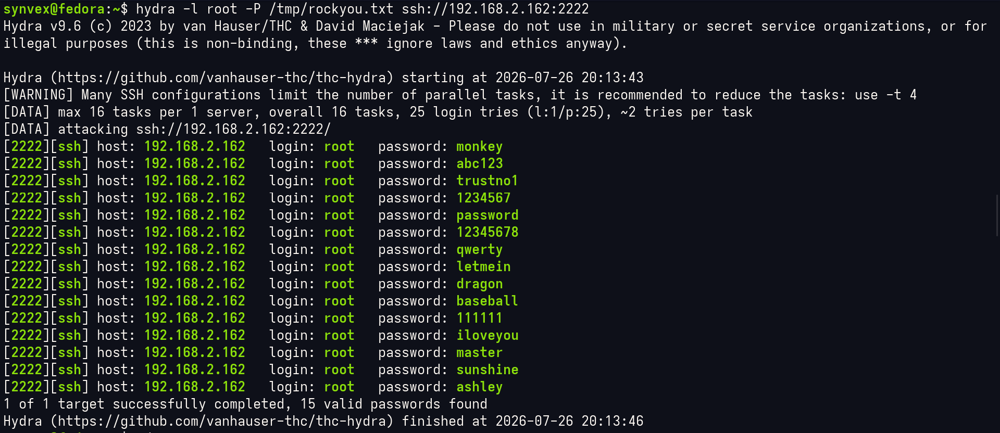
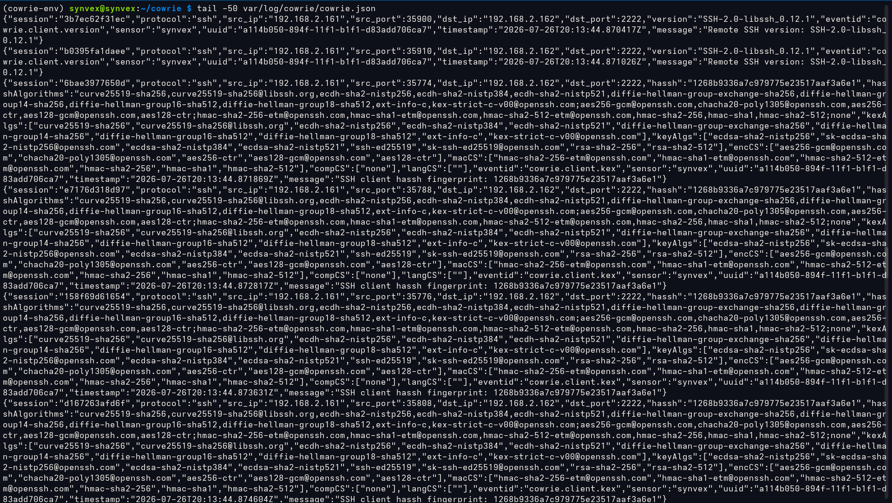

# I Built a SSH Honeypot and Got Attacked

I set up a fake SSH server on my Raspberry Pi to see what real attackers actually do. Actually I attacked it using Hydra and some basic RCE. Here's what I found.

## The Setup

Raspberry Pi 4 running Cowrie (a honeypot that pretends to be a real SSH server). A Fedora Linux on the same network with Hydra (a brute-force tool). I attacked my own honeypot and logged everything.

## The Attack

I told Hydra to throw 25 common passwords at the honeypot, 16 connections at a time. Total time: 3.4 seconds.

**Results:**
- 14 passwords worked
- 1 failed
- All events logged in JSON



## What Worked

Every basic password on the list got in except one:

- monkey ✓
- password ✓
- qwerty ✓
- dragon ✓
- trustno1 ✓
- 1234567 ✓
- abc123 ✓
- sunshine ✓
- letmein ✓
- baseball ✓
- 111111 ✓
- iloveyou ✓
- master ✓
- 12345678 ✓
- **123456 ✗** (this one failed)

## The Weird Part

The failed password took 5x longer than the successful ones. Failed attempts: ~1.3 seconds. Successful: ~0.3 seconds. Why? Probably SSH adds extra delay on wrong credentials to slow down attackers. Didn't work here.

## Looking at the Logs


Each SSH event is a line of JSON. Here's what happened:

**Attack started:**
```
2026-07-26T20:13:44.242399Z: New connection from 192.168.2.161:35760
2026-07-26T20:13:44.245132Z: SSH-2.0-libssh_0.12.1 (attacking with a C library, not standard OpenSSH)
```

**First successful login:**
```json
{
  "timestamp": "2026-07-26T20:13:45.069481Z",
  "username": "root",
  "password": "monkey",
  "eventid": "cowrie.login.success"
}
```

**The failed attempt:**
```json
{
  "timestamp": "2026-07-26T20:13:45.109768Z",
  "username": "root",
  "password": "123456",
  "eventid": "cowrie.login.failed"
}
```

**Session closed immediately after:**
```json
{
  "duration_ms": 261,
  "eventid": "cowrie.session.closed"
}
```



## What This Tells Me

**1. The attacker is automated**

16 parallel connections means no human. Hydra or similar tool. They don't care about being stealthy—just throwing everything at the wall.

**2. Weak passwords are a real problem**

14/15 worked. If this was a real server, the attacker owns it now.

**3. They don't stick around**

Session lasted 261ms. No shell commands, no interaction. They logged in, verified the credential works, then disconnected. Classic credential-spraying behavior—checking if this password works across multiple targets.

**4. I can fingerprint the attacker**

HASSH is a fingerprint of the SSH client. This attacker used `1268b9336a7c979775e23517aaf3a6e1`, which maps to libssh 0.12.1 (a C library used for SSH automation). 

A blue team could:
- Blacklist this HASSH fingerprint
- Alert on 10+ login attempts/minute
- Lock accounts after 5 failed attempts

**5. Timing leaks information**

Failed login = 1.3 seconds
Successful login = 0.3 seconds

An attacker who cares could use this to fingerprint whether a username exists, even without logging in.

## How I Extracted the Data

Pull all successful logins:
```bash
jq 'select(.eventid == "cowrie.login.success")' cowrie.json | jq -r '.password' | sort | uniq -c
```

Count total events:
```bash
jq 'select(.eventid == "cowrie.login.success")' cowrie.json | wc -l
```

See the attack timeline:
```bash
jq -r '[.timestamp, .eventid, .username, .password] | @csv' cowrie.json | sort
```

## Files

- `cowrie.json` — Raw attack log (1,500+ events)
- `images/` — Screenshots

## Why This Matters

Most security people learn attacks from theory or labs. I wanted to see what real attack traffic looks like. Now I have concrete data:
- How attackers behave
- What they target (weak credentials, common usernames)
- How fast they work
- How to detect them

This is going straight into my red team playbook.

---

**Date:** July 26, 2026  
**Author:** synv3x  
**Honeypot:** Cowrie on Raspberry Pi 4  
**Attacker:** Fedora laptop (Hydra)  
**Result:** 14/15 passwords cracked in 3.4 seconds
